<div align="center">

<h3><code>lymon@github ~ $ ./contributions.sh</code></h3>



<br><br>

<h3><code>lymon@github ~ $ whoami</code></h3>

<table>
<tr>
<td valign="top">

</td>
<td valign="top">

</td>
</tr>
</table>

</div>

---

## `lymon@github:~$ about`

I'm **Abdulsattar Mohamed (lymonDa)** — a software engineer and product builder focused on turning ideas into useful, maintainable digital products.

I work across frontend, backend, mobile, APIs, databases, deployment, and automation. I care about clean architecture, practical engineering decisions, and shipping products that can evolve instead of becoming disposable prototypes.

---

## `lymon@github:~$ stack`

```text
Languages     TypeScript · JavaScript · Python · Dart
Frontend      React · Next.js · Angular
Mobile        Flutter
Backend       Node.js · Express · Fastify
APIs          REST APIs · API Design · Testing
Data          PostgreSQL · MongoDB · Supabase
Engineering  Clean Code · SOLID · Design Patterns
Systems       System Design · Scalable Architecture
DevOps        Docker · CI/CD · GitHub Actions
Cloud         Deployment · Automation · DevOps workflows
```

---

## `lymon@github:~$ projects`

### `Dawwarha`
A full-stack product experience built around transfer, trust, lifecycle, contribution, impact, notifications, and reporting workflows.

### `AL-Azhary Web Store`
A modern web-store project focused on practical e-commerce UX and scalable frontend implementation.

### `More`
I continuously build and experiment with web applications, mobile products, APIs, SaaS ideas, automation, and developer tooling.

---

## `lymon@github:~$ services`

- **Web Applications** — responsive, production-ready interfaces and full-stack applications.
- **Mobile Applications** — cross-platform product experiences with Flutter.
- **SaaS & Product Development** — from architecture and MVPs to scalable product foundations.
- **Backend & APIs** — REST APIs, integrations, databases, authentication, and business logic.
- **Deployment & Automation** — Docker, CI/CD, GitHub Actions, and repeatable delivery workflows.
- **Engineering & Refactoring** — clean code, maintainability, testing, and architecture improvements.

---

## `lymon@github:~$ links`

- Portfolio: https://lymon-da-dev.vercel.app/
- GitHub: https://github.com/lymonDa/

---

## `lymon@github:~$ system`

This profile is intentionally built without a third-party GitHub stats service.

- `avi-ascii.svg` — generated from my portrait and animated as a self-typing ASCII render.
- `info-card.svg` — a handcrafted terminal/neofetch-style identity card.
- `contrib-heatmap.svg` — generated from my public GitHub contribution calendar.
- `GitHub Actions` — refreshes the contribution data automatically every day.
- `No JavaScript` — the README only embeds self-contained SVG assets.
- `No GitHub token` — the contribution workflow reads GitHub's public contribution calendar.

### Local regeneration

```bash
python -m venv .venv
source .venv/bin/activate
pip install -r scripts/requirements.txt

python scripts/prep_photo.py source-photo.jpg
python scripts/make_ascii_svg.py
python scripts/make_info_card.py
python scripts/fetch_contributions.py
python scripts/render_heatmap_svg.py
```

The contribution graph is refreshed by `.github/workflows/update-profile-art.yml`.

---

<div align="center">

<sub>Built with Python, SVG, GitHub Actions, and a terminal mindset.</sub>

</div>
